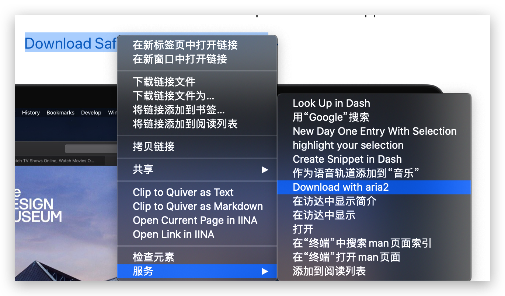
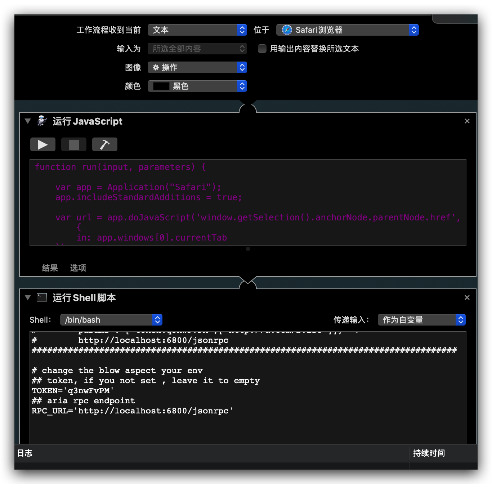

## 添加下载链接到 Aria 服务中

从 MacOS 10.14 起， [Safari](https://www.apple.com/safari/) 的扩展就无法通过手工添加的方式加载，必须从新创建的应用商店才可以，导致很多的插件无法使用。
比如自动添加下载链接到 [Aria](https://github.com/aria2/aria2) 下载服务中。

于是尝试通过 MacOS 自带的自动化工具提供一个“服务”来达到同样的效果，效果如下：



## 安装要求

1. Safari 开启开发菜单：具体为点击Safari浏览器的偏好设置，在`高级`标签页中，勾选`在菜单栏中显示“开发”菜单`
2. 点击 Safari 的 `开发` 菜单，然后勾选 `允许Apple事件中的JavaScript`，该操作会要求输入密码用来确定

## 安装

从[这里](../download_with_aria.zip)下载工作流压缩包到本地。

然后执行下面的下面的指令

```
unzip -q -d $HOME/Library/Services/  download_with_aria.zip
```

## 验证

打开浏览器，找一个下载链接，然后点击右键，在最下面的 `服务` 菜单里可以看到 `Download with aria2` 的子菜单

## 自定义

Aria2c  默认的地址为 <http://localhost:6800/jsonrpc> , 如果你的环境不同，则需要修改服务。

修改方法用自动操作应用程序(`Automator.app`) 打开 `~/Library/Services/Download with aria2.workflow` 工作流，如下图所示:



找到 `运行shell脚本` 工作流的下面这几行

```shell
# change the blow aspect your env
## token, if you not set , leave it to empty
TOKEN='q3nwFvPM'
## aria rpc endpoint
RPC_URL='http://localhost:6800/jsonrpc'
```

根据你的实际情况进行修改，如果你没有开启 token ，则将变量 `TOKEN` 设置为空，类似如下:

```
TOKEN=''
```
